 

  
  <!-- Image floated to the left -->
  
  
  <!-- Content wrapping on the right -->
  
   

  

    <b>Transforming complex challenges</b> into elegant solutions through advanced <b>AI pipelines</b>, project portfolio management architectures, and enterprise-grade deployments.
  

   

  

    &emsp;&emsp;
    
    
    
  

   

<!-- This clears the float so the rest of your profile doesn't wrap around the image -->
 

 

  

<h3>Bridging Advanced Engineering &amp; Enterprise Strategy</h3>

True innovation lives at the intersection of deep tech and organizational strategy. As an AI Software Engineer and certified Broadcom Partner Consultant, I bridge cutting-edge technology and real-world business execution—designing, training, and deploying sophisticated AI systems while structuring the portfolio management, workflows, and governance needed to scale them. Because most tech initiatives fail in execution, not intelligence, my dual perspective ensures every model delivers measurable ROI. Whether engineering autonomous AI solutions or structuring complex enterprise portfolios, I translate technical potential into sustainable business value.

  

Driving enterprise transformation at the intersection of <b>Agentic AI Architecture</b>, <b>Value Stream Orchestration</b>, and <b>Project Portfolio Management (PPM)</b>.

  
Agentic AI frameworks and custom Model Context Protocol (MCP) servers to seamlessly extend enterprise ecosystems (Clarity PPM, Automic Automation, and ITSM).

  
High-performing, containerized full-stack platforms—including ZerOS and Stratogen—built with TypeScript, Vite, Python, and Docker.

  
Resilient, multi-system workflows and enterprise data pipelines using Temporal SDK and Broadcom ValueOps architectures.

  
Scaling Generative AI &amp; RAG in regulated environments, AI governance, enterprise digital transformation, and aligning machine learning capabilities with business ROI.

  

<h4>AI, Machine Learning & Data Science</h4>

 

<h4>Web Frameworks & Frontend</h4>

<h4>Backend, Databases & APIs</h4>

<h4>DevOps, Cloud & Architecture</h4>

  

  

<b>B.Sc. in Computer Science (AI &amp; Data Science)</b> 
<i>Tafila Technical University, Jordan</i> | Graduation: June 2024

<h4>Specialized Certifications &amp; Technical Mastery:</h4>

  
Broadcom Certified Partner (Clarity PPM Implementation &amp; Sales), ValueOps VSM Agile Metrics &amp; Strategy, Workflow &amp; Data Orchestration (Automic Automation).

  
Microsoft Intro to Generative AI &amp; Agents, Deep Learning, NLP &amp; Computer Vision (TensorFlow/PyTorch), Advanced RAG &amp; MCP Architecture.

  
Docker Essentials (IBM), Microsoft Intro to DevOps, Cisco Networking Essentials, Kubernetes, Vector DB Configurations &amp; Linux System Engineering.

  <i>"Building the future of automation, one intelligent system at a time."</i>  

  

    
  

